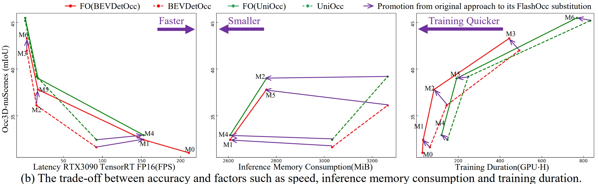
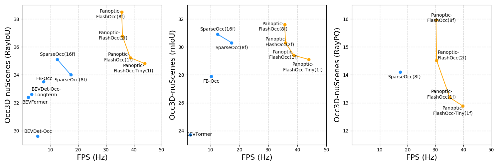
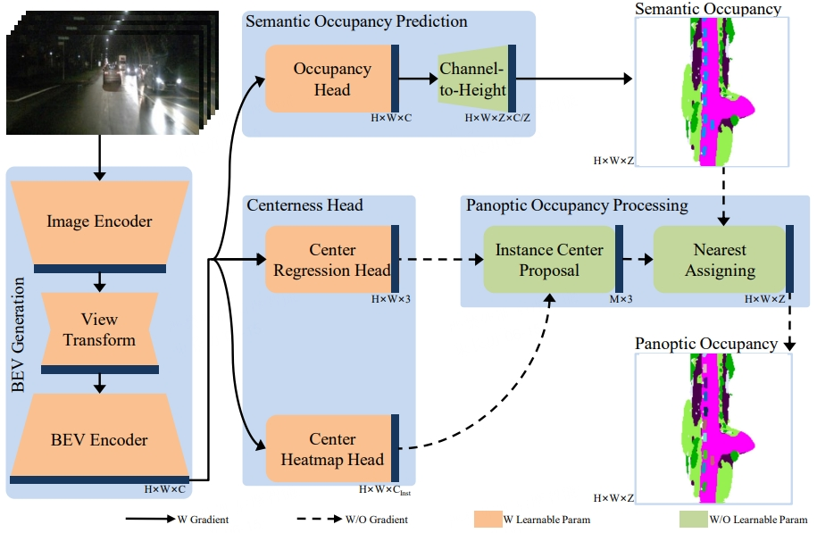

# FlashOcc: Fast and Memory-Efficient Occupancy Prediction via Channel-to-Height Plugin


<div align="left">
  
</div><br/>
* Please note that the FPS here is measured with RTX3090 TensorRT FP16.

# Panoptic-FlashOcc: An Efficient Baseline to Marry Semantic Occupancy with Panoptic via Instance Center

<div align="left">
  
</div><br/>
* Please note that the FPS here is measured with A100 GPU (PyTorch fp32 backend).

## News
- **2024.09.16** Technical Report: FlashOcc can be insert to Bevdet with 1.1ms consumption while facilitating each other.[](https://arxiv.org/abs/2409.11160)
- **2024.09.16** [Selected as reference algorithm for occupancy on horizon J6E/M](https://zhuanlan.zhihu.com/p/720461546)
- **2024.06.10** Release the code for Panoptic-FlashOCC
- **2024.04.17** Support for ray-iou metric
- **2024.03.22** Release the code for FlashOCCV2
- **2024.02.03** [Release the training code for FlashOcc on UniOcc](https://github.com/drilistbox/FlashOCC_on_UniOcc_and_RenderOCC)
- **2024.01.20** [TensorRT Implement Writen In C++ With Cuda Acceleration](https://github.com/drilistbox/TRT_FlashOcc)
- **2023.12.23** Release the quick testing code via TensorRT in MMDeploy.
- **2023.11.28** Release the training code for FlashOCC.

<!-- - [History](./docs/en/news.md) -->

<!-- ## Introduction -->

[](https://arxiv.org/abs/2311.12058)
[](https://arxiv.org/pdf/2406.10527)
[](https://arxiv.org/abs/2409.11160)


This repository is an official implementation of [FlashOCC](https://arxiv.org/abs/2311.12058) 

<div align="center">
  
</div><br/>

and [Panoptic-FlashOCC](https://arxiv.org/pdf/2406.10527)

<div align="center">
  
</div><br/>


## Main Results
### 1. FlashOCC
|                                               Config                                                | Backbone | Input <br/>Size |  mIoU   |            FPS<br/>(Hz)            |                                             Flops<br/>(G)                                             |                                           Params<br/>(M)                                           |                                Model                                |                                              Log                                               |
|:---------------------------------------------------------------------------------------------------|:--------:|:----------:|:-------:|:-----------------------------:|:------------------------------------------------------------------------------------------------:|:---------------------------------------------------------------------------------------------:|:-------------------------------------------------------------------:|:----------------------------------------------------------------------------------------------:|
|                 [**BEVDetOCC (1f)**](projects/configs/bevdet_occ/bevdet-occ-r50.py)                 |   R50    |  256x704   |  31.60  |             92.1              |  [241.76](doc/mmdeploy_test.md)   |  [29.02](doc/mmdeploy_test.md)  |                                            [gdrive]()                                            |                                            [log]()                                            |
|                 [**M0: FlashOCC (1f)**](projects/configs/flashocc/flashocc-r50.py)                  |   R50    |  256x704   |  31.95  | [197.6](doc/mmdeploy_test.md) |   [154.1](doc/mmdeploy_test.md)   |  [39.94](doc/mmdeploy_test.md)  |   [gdrive](https://drive.google.com/file/d/14my3jdqiIv6VIrkozQ6-ruEcBOPVlWGJ/view?usp=sharing)   |   [log](https://drive.google.com/file/d/1E-kaHxbTr6s3Qn70vhKpwJM8kejoNFxQ/view?usp=sharing)   |
|                 [**M1: FlashOCC (1f)**](projects/configs/flashocc/flashocc-r50.py)                  |   R50    |  256x704   |  32.08  | [152.7](doc/mmdeploy_test.md) |  [248.57](doc/mmdeploy_test.md)   |  [44.74](doc/mmdeploy_test.md)  | [gdrive](https://drive.google.com/file/d/1k9BzXB2nRyvXhqf7GQx3XNSej6Oq6I-B/view?usp=drive_link)  | [log](https://drive.google.com/file/d/1NRm27wVZMSUylmZxsMedFSLr7729YEAV/view?usp=drive_link)  |
|       [**BEVDetOCC-4D-Stereo (2f)**](projects/configs/bevdet_occ/bevdet-occ-r50-4d-stereo.py)       |   R50    |  256x704   |  36.1   |               -               |                -                |                -                |                [baidu](https://pan.baidu.com/s/1237QyV18zvRJ1pU3YzRItw?pwd=npe1)                 |                [log](https://pan.baidu.com/s/1237QyV18zvRJ1pU3YzRItw?pwd=npe1)                |
|        [**M2:FlashOCC-4D-Stereo (2f)**](projects/configs/flashocc/flashocc-r50-4d-stereo.py)        |   R50    |  256x704   |  37.84  |               -               |                -                |                -                | [gdrive](https://drive.google.com/file/d/12WYaCdoZA8-A6_oh6vdLgOmqyEc3PNCe/view?usp=drive_link)  | [log](https://drive.google.com/file/d/1eYvu9gUSQ7qk7w7lWPLrZMB0O2uKQUk3/view?usp=drive_link)  |
| [**BEVDetOCC-4D-Stereo (2f)**](projects/configs/bevdet_occ/bevdet-occ-stbase-4d-stereo-512x1408.py) |  Swin-B  |  512x1408  |  42.0   |               -               |                -                |                -                |                [baidu](https://pan.baidu.com/s/1237QyV18zvRJ1pU3YzRItw?pwd=npe1)                 |                [log](https://pan.baidu.com/s/1237QyV18zvRJ1pU3YzRItw?pwd=npe1)                |
|    [**M3:FlashOCC-4D-Stereo (2f)**](projects/configs/flashocc/flashocc-stbase-4d-stereo-512x1408_4x4_2e-4.py)     |  Swin-B  | 512x1408   |   43.52 |               -               | [1490.77](doc/mmdeploy_test.md) | [144.99](doc/mmdeploy_test.md)  | [gdrive](https://drive.google.com/file/d/1f6E6Bm6enIJETSEbfXs57M0iOUU997kU/view?usp=drive_link)  | [log](https://drive.google.com/file/d/1tch-YK4ROGDGNmDcN5FZnOAvsbHe-iSU/view?usp=drive_link)  |

FPS are tested via TensorRT on 3090 with FP16 precision. Please refer to Tab.2 in paper for the detail model settings for M-number.

### 2. Panoptic-FlashOCC
**In Panoptic-FlashOCC, we have made the following 3 adjustments to FlashOCC**:
- Without using camera mask for training. This is because its use significantly improves the prediction performance in the visible region, but at the expense of prediction in the invisible region.
- Using category balancing.
- Using stronger loss settings.
- Introducing instance center for panoptic occupancy

**More results for different configurations will be released soon.**

|                                      Config                                      | Backbone | Input <br/>Size  | RayIou | RayPQ |  mIoU  | FPS<br/>(Hz) |         Flops<br/>(G)          |        Params<br/>(M)         |                                              Model                                              |                                             Log                                              |
|:--------------------------------------------------------------------------------|:--------:|:-----------:|:-------:|:------:|:------:|:------------:|:------------------------------:|:-----------------------------:|:-----------------------------------------------------------------------------------------------:|:--------------------------------------------------------------------------------------------:|
|          [**M1: FlashOCC (1f)**](projects/configs/flashocc/flashocc-r50.py)          |   R50    |   256x704   |    -    | - | 15.41  |     -     | [248.57](doc/mmdeploy_test.md) | [44.74](doc/mmdeploy_test.md) |                                           [gdrive](https://drive.google.com/file/d/14XsvjSwp-vLpy_eBZzvKo3MAh-YWRHcu/view?usp=drive_link)                                            |                                           [log](https://drive.google.com/file/d/1cTDoauEmjhK9fReLDcA2zPZx4a6X3U1-/view?usp=drive_link)                                            |
| [**Panoptic-FlashOCC-Depth-tiny (1f)**](projects/configs/panoptic-flashocc/panoptic-flashocc-r50-depth-tiny.py) |   R50    |   256x704   |  34.57  | - | 28.83  |     43.9     | [175.00](doc/mmdeploy_test.md) | [45.32](doc/mmdeploy_test.md) | [gdrive](https://drive.google.com/drive/folders/1cgCsbXgikoP10lj6DBC7Le9C-UOCIxlN?usp=sharing) | [log](https://drive.google.com/drive/folders/1cgCsbXgikoP10lj6DBC7Le9C-UOCIxlN?usp=sharing) |
| [**Panoptic-FlashOCC-Depth-tiny-Pano (1f)**](projects/configs/panoptic-flashocc/panoptic-flashocc-r50-depth-tiny-pano.py) |   R50    |   256x704   |  34.81  | 12.9 | 29.14  |     39.8     | [175.00](doc/mmdeploy_test.md) | [45.32](doc/mmdeploy_test.md) | [gdrive](https://drive.google.com/drive/folders/1cgCsbXgikoP10lj6DBC7Le9C-UOCIxlN?usp=sharing) | [log](https://drive.google.com/drive/folders/1cgCsbXgikoP10lj6DBC7Le9C-UOCIxlN?usp=sharing) |
| [**Panoptic-FlashOCC-Depth (1f)**](projects/configs/panoptic-flashocc/panoptic-flashocc-r50-depth.py) |   R50    |   256x704   |  34.93  | - |  28.91 |     38.7     | [269.47](doc/mmdeploy_test.md) | [50.12](doc/mmdeploy_test.md) | [gdrive](https://drive.google.com/drive/folders/1cgCsbXgikoP10lj6DBC7Le9C-UOCIxlN?usp=sharing) | [log](https://drive.google.com/drive/folders/1cgCsbXgikoP10lj6DBC7Le9C-UOCIxlN?usp=sharing) |
| [**Panoptic-FlashOCC-Depth-Pano (1f)**](projects/configs/panoptic-flashocc/panoptic-flashocc-r50-depth-pano.py) |   R50    |   256x704   |  35.22  | 13.2 |  29.39 |     35.2     | [269.47](doc/mmdeploy_test.md) | [50.12](doc/mmdeploy_test.md) | [gdrive](https://drive.google.com/drive/folders/1cgCsbXgikoP10lj6DBC7Le9C-UOCIxlN?usp=sharing) | [log](https://drive.google.com/drive/folders/1cgCsbXgikoP10lj6DBC7Le9C-UOCIxlN?usp=sharing) |
| [**Panoptic-FlashOCC-4D-Depth (2f)**](projects/configs/panoptic-flashocc/panoptic-flashocc-r50-depth4d.py) |   R50    |   256x704   |  35.99  | - |  29.57 |     35.9     |               -                |               -               | [gdrive](https://drive.google.com/drive/folders/1cgCsbXgikoP10lj6DBC7Le9C-UOCIxlN?usp=sharing) | [log](https://drive.google.com/drive/folders/1cgCsbXgikoP10lj6DBC7Le9C-UOCIxlN?usp=sharing) |
| [**Panoptic-FlashOCC-4D-Depth-Pano (2f)**](projects/configs/panoptic-flashocc/panoptic-flashocc-r50-depth4d-pano.py) |   R50    |   256x704   |  36.76  | 14.5 |  30.31 |     30.4     |               -                |               -               | [gdrive](https://drive.google.com/drive/folders/1cgCsbXgikoP10lj6DBC7Le9C-UOCIxlN?usp=sharing) | [log](https://drive.google.com/drive/folders/1cgCsbXgikoP10lj6DBC7Le9C-UOCIxlN?usp=sharing) |
| [**Panoptic-FlashOCC-4DLongterm-Depth (8f)**](projects/configs/panoptic-flashocc/panoptic-flashocc-r50-depth4d-longterm8f.py) |   R50    |   256x704   |  38.51  | - |  31.49 |     35.6     |               -                |               -               | [gdrive](https://drive.google.com/drive/folders/1cgCsbXgikoP10lj6DBC7Le9C-UOCIxlN?usp=sharing) | [log](https://drive.google.com/drive/folders/1cgCsbXgikoP10lj6DBC7Le9C-UOCIxlN?usp=sharing) |
| [**Panoptic-FlashOCC-4DLongterm-Depth-Pano (8f)**](projects/configs/panoptic-flashocc/panoptic-flashocc-r50-depth4d-longterm8f.py) |   R50    |   256x704   |  38.50  | 16.0 | 31.57 |     30.2     |               -                |               -               | [gdrive](https://drive.google.com/drive/folders/1cgCsbXgikoP10lj6DBC7Le9C-UOCIxlN?usp=sharing) | [log](https://drive.google.com/drive/folders/1cgCsbXgikoP10lj6DBC7Le9C-UOCIxlN?usp=sharing) |

* Please note that the FPS here is measured with A100 GPU (PyTorch fp32 backend).

## Get Started
1. [Environment Setup](doc/install.md)
2. [Model Training](doc/model_training.md)
3. [Quick Test Via TensorRT In MMDeploy](doc/mmdeploy_test.md)

| Backend  | mIOU  | FPS(Hz) |
|----------|-------|---------|
| PyTorch-FP32                                    | 31.95 |    -  |
| TRT-FP32                                        | 30.78 |  96.2 |
| TRT-FP16                                        | 30.78 | 197.6 |
| TRT-FP16+INT8(PTQ)                              | 29.60 | 383.7 |
| TRT-INT8(PTQ)                                   | 29.59 | 397.0 |

4. [Visualization](doc/visualization.md)
 * [flashocc] : A detail video can be found at [baidu](https://pan.baidu.com/s/1xfnFsj5IclpjJxIaOlI6dA?pwd=gype)
<div align="center">
  
</div><br/>

 * [panoptic-flashocc] : first row is our prediction and second row is gt.
<div align="center">
  
</div><br/>

<div align="center">
  
</div><br/>


5. [TensorRT Implement Writen In C++ With Cuda Acceleration](https://github.com/drilistbox/TRT_FlashOcc)


## Acknowledgement
Many thanks to the authors of [BEVDet](https://github.com/HuangJunJie2017/BEVDet), [FB-BEV](https://github.com/NVlabs/FB-BEV.git),
[RenderOcc](https://github.com/pmj110119/RenderOcc.git) and [SparseBEV](https://github.com/MCG-NJU/SparseBEV.git)

## Bibtex
If this work is helpful for your research, please consider citing the following BibTeX entry.

```
@article{yu2024ultimatedo,
  title={UltimateDO: An Efficient Framework to Marry Occupancy Prediction with 3D Object Detection via Channel2height},
  author={Yu, Zichen and Shu, Changyong},
  journal={arXiv preprint arXiv:2409.11160},
  year={2024}
}

@article{yu2024panoptic,
  title={Panoptic-FlashOcc: An Efficient Baseline to Marry Semantic Occupancy with Panoptic via Instance Center},
  author={Yu, Zichen and Shu, Changyong and Sun, Qianpu and Linghu, Junjie and Wei, Xiaobao and Yu, Jiangyong and Liu, Zongdai and Yang, Dawei and Li, Hui and Chen, Yan},
  journal={arXiv preprint arXiv:2406.10527},
  year={2024}
}

@article{yu2023flashocc,
      title={FlashOcc: Fast and Memory-Efficient Occupancy Prediction via Channel-to-Height Plugin}, 
      author={Zichen Yu and Changyong Shu and Jiajun Deng and Kangjie Lu and Zongdai Liu and Jiangyong Yu and Dawei Yang and Hui Li and Yan Chen},
      year={2023},
      eprint={2311.12058},
      archivePrefix={arXiv},
      primaryClass={cs.CV}
}
```
